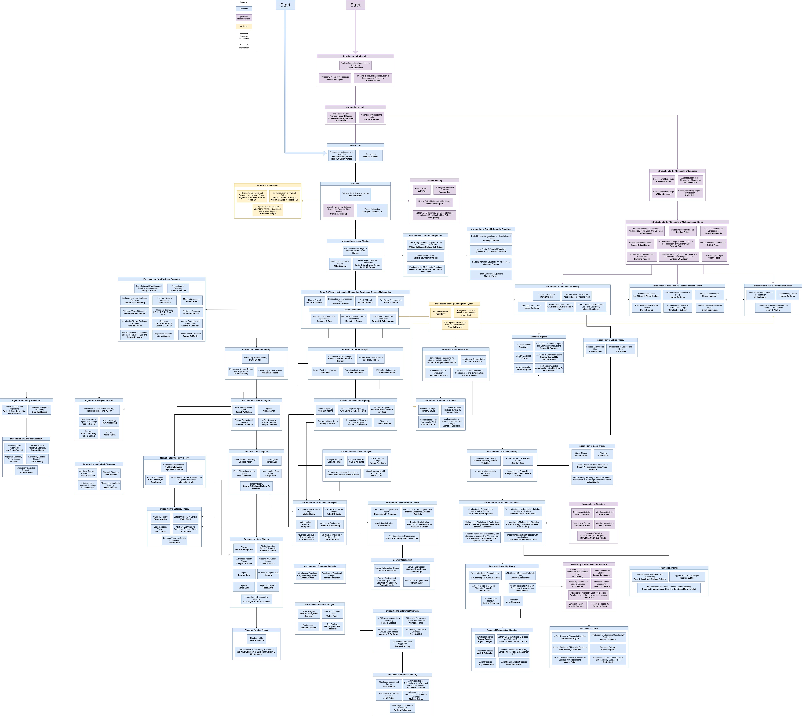

parent::[___Home](___Home.md)

```dataview
list from [[]] and !outgoing([[]])
```
[mathematics-roadmap-topics](mathematics-roadmap-topics.md)



## Calculus
1) Courant Vol 1 (finish in 10 weeks)
2) Courant vol 2 (84 sections/8 sections per week = ~11 weeks)
## Statistics and Probability
1) Hogg - Introduction to Mathematical Statistics (75 sections -> 5 per week = 15 weeks Finish Apr. 14th)
2) Feller- Introduction to Probability
3) Casella
4) IMLSP
5) E.P. Box
## Analysis
1) Abbott - Understanding Analysis (40 sections/ 4 per week = 10 weeks. Finish by 2026 Feb 28)
	1) Richard Hammond - Book of Proofs
	2) Vellman - How to Prove it
2) Terrence Tao Analysis I (overlap with Abbot. 63 sections/8 sections a week = 8 weeks)
3) Terrence Tao Analysis II 
4) Baby Rudin (11 chapters/ 1 chapter per week = 11 weeks.)
5) Newman
6) Conway
7) Alfohrs
## Differential Equations
1) Simmons - Historical introduction to ODEs (7)
2)  _**Differential Equations, Dynamical Systems, and Linear Algebra**_ - Hirsch
3) _**Theory of ordinary differential equations**_-Coddington
4) 
## Linear Algebra
1) Strang - Linear Algebra (Finish by Nov. 22)
2) Friedberg, Insel Linear Algebra - (Start Dec. 14th finish Feb 28th)
3) Axler
## Discrete Mathematics
- Beginner
- Knuth
## Abstract Algebra
- Dummit and Foote 
- Topics in algebra
- Lang, Algebra (advanced) 
- Jacobson Basic Algebra I and II (advanced)
## Number Theory
- Kenneth Rosen Elementary Number Theory
- G.H. Hardy EM Wright- Introduction to number theory (more advanced)
## Computer Science
- Pandas
- Cormen
- 
## Thermodynamics
1) McCallen
2) 

## Mechanics
1) Taylor
2) The classic one
## Electrodynamics
1) The classic one